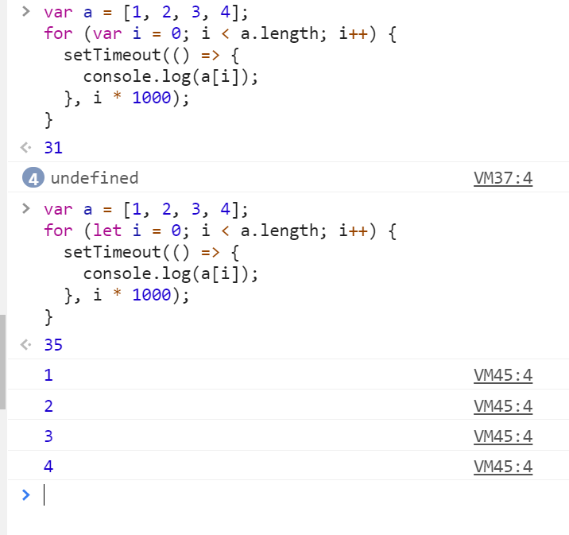
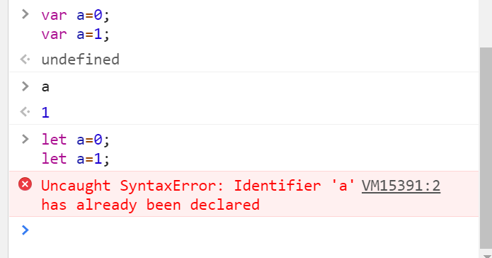

- 本文引用链接：https://www.cnblogs.com/fly_dragon/p/8669057.html

* 首先，理解下面的例子，var 定义的 i 全局有效，所以后来输出的 a[i]实际上都是 a[4]，即 undefined。
  

# 变量提升

- 下面的例子，如果 f 中没有定义 a，那么 f 中第一个打印结果是 99；但是变量提升会先定义`var=a;`,但是没有赋值，所以第一个打印结果是默认值 undefined。

```javascript
var a = 99; // 全局变量a
f(); // f是函数，虽然定义在调用的后面，但是函数声明会提升到作用域的顶部。
console.log(a); // a=>99,  此时是全局变量的a
function f() {
  console.log(a); // 当前的a变量是下面变量a声明提升后，默认值undefined
  var a = 10;
  console.log(a); // a => 10
}
```

- 下面的例子，即使 if 的判断条件是 false，也会变量提升，打印出来的结果都是 undefine

```javascript
var tmp = 123;

function f() {
  console.log(tmp); //undefine
  if (false) {
    var tmp = "hello world";
    console.log(tmp);
  }
}

f();
```

- 注意：let 没有变量提升，所以如果在定义之前使用变量，会报错:` Uncaught ReferenceError: xxx is not defined`,而 var 的变量提升， 值为默认的 undefined，不会报错。
- let 变量不能重复定义：
  

# 暂时性死区

只要块级作用域内存在 let 命令，它所声明的变量就“绑定”（binding）这个区域，不再受外部的影响

```javascript
var tmp = 123;

if (true) {
  tmp = "abc"; // ReferenceError
  let tmp;
}
```

上面的例子中，存在全局变量 tmp，但是块级作用域内 let 又声明了一个局部变量 tmp，导致后者绑定这个块级作用域，所以在 let 声明变量前，对 tmp 赋值会报错。

ES6 明确规定，如果区块中存在 let 和 const 命令，这个区块对这些命令声明的变量，从一开始就形成了封闭作用域。凡是在声明之前就使用这些变量，就会报错。

```javascript
if (true) {
  // 暂时性死区 开始
  tmp = "abc"; // ReferenceError
  console.log(tmp); // ReferenceError

  let tmp; // 暂时性死区 结束
  console.log(tmp); // undefined

  tmp = 123;
  console.log(tmp); // 123
}
```

上面代码中，在 let 命令声明变量 tmp 之前，都属于变量 tmp 的“死区”。

“暂时性死区”也意味着 typeof 不再是一个百分之百安全的操作:

```javascript
typeof x; // ReferenceError
let x;
```

上面代码中，变量 x 使用 let 命令声明，所以在声明之前，都属于 x 的“死区”，只要用到该变量就会报错。因此，typeof 运行时就会抛出一个 ReferenceError。

作为比较，如果一个变量根本没有被声明，使用 typeof 反而不会报错。

```javascript
typeof undeclared_variable; // "undefined"
```

所以，在没有 let 之前，typeof 运算符是百分之百安全的，永远不会报错。现在这一点不成立了。这样的设计是为了让大家养成良好的编程习惯，变量一定要在声明之后使用，否则就报错。
