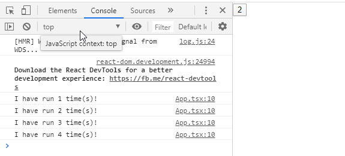

# 严格模式

https://zh-hans.reactjs.org/docs/strict-mode.html#identifying-unsafe-lifecycles

#### StrictMode 目前有助于：

1. 识别不安全的生命周期
2. 关于使用过时字符串 ref API 的警告
3. 关于使用废弃的 findDOMNode 方法的警告
4. 检测意外的副作用
5. 检测过时的 context API

未来的 React 版本将添加更多额外功能。

```javascript
let count = 0;
function App() {
  const [state, setState] = useState(1);
  count++;
  console.log(`I have run ${count} time(s)!`);
  return (
    <div>
      <button onClick={() => setState((e) => e + 1)}>{state}</button>
    </div>
  );
}
export default App;
```

上面的例子，在浏览器中的结果是运行两次，而且结果不同：

点击一下按钮，状态更新：


- 在 react strict mode 下会刻意渲染两次，为了预防副作用带来的影响，这两次的 props 和 state 是一样的，按理说返回的结果也应该是一样的，如果不一样，说明代码中存在副作用。
- 对于 react 而言，它推崇的是渲染结果只与 state 和 props 有关，也就是说，result = f(props, state)。
